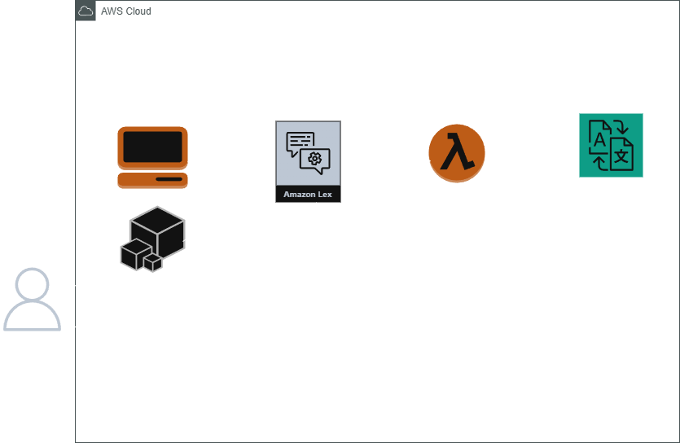

<p align="center">
  
  
## ☁️  Build a language translation bot using Amazon Lex ☁️

In this project, I created a language translation bot where you can input a word or a sentence into the chatbot, and it will output the translation. By combining Amazon Translate for real-time language conversion, Amazon Lex for conversational interfaces, and AWS Lambda for backend logic, such a solution can be powerful, scalable, and accessible! 🌟


<h2>Environments and Technologies Used</h2>

  - Amazon Web Services (AWS)
  - AWS Console 
  - AWS CLI
  - Amazon Lex
  - AWS Lambda
  - IAM (for managing user permissions)
  - Amazon Translate
  - Python
  - AWS SDK 

  
<h2>Real World applications</h2>  


- 🚀 Tourism and Hospitality: Chatbots can act as virtual assistants for travelers. A chatbot in a hotel app can handle room service requests or check-in instructions in the traveler’s language.
In a tourist guide app, the chatbot can provide translated information about local attractions and services.


- 🌍 Customer Support Across Borders:
A multilingual chatbot can help businesses provide customer support in real-time across various languages, enabling them to cater to a global audience. For example: An e-commerce platform offering 24/7 support to customers in English, Spanish, French, and Chinese.
A travel agency chatbot assisting users with bookings, cancellations, and FAQs in their preferred language.


- 🏢 Corporate Training and HR Assistance:
Organizations with diverse teams can use a chatbot to assist employees in multiple languages. For corporate training, employees can ask questions in their native language, and the chatbot responds appropriately.
For HR support, the chatbot can handle queries about policies, leave requests, or payroll in various languages.


<h2>How to Build</h2>

1. **Create IAM Roles for the Tools along with creation of our empty chatbot**  
In this step, we will create the bot to start our project. We will showcase both AWS console and AWS CLI scenarios, as well as define IAM roles necessary to execute the functions.

**AWS Console option**

We will be creating it through the console in this part. We will go through Amazon lex, and create a bot with English language and set `Intent classification confidence score threshold` as 0.40.


**AWS CLI option**
With this option we will be utilizing AWS CLI through the cloudshell. 

First, we create an IAM role specific for Amazon Lex, Lambda and Amazon Translate usage. Make sure that the --role-name applies to the role name you want to assign:

Amazon Lex 
```
aws iam create-role \
    --role-name CaraccioloChatbotRole \
    --assume-role-policy-document '{
        "Version": "2012-10-17",
        "Statement": [
            {
                "Effect": "Allow",
                "Principal": {
                    "Service": "lex.amazonaws.com"
                },
                "Action": "sts:AssumeRole"
            }
        ]
    }'
```
AWS Lambda and Amazon Translate

```
aws iam create-role \
    --role-name LambdaTranslateRole \
    --assume-role-policy-document '{
        "Version": "2012-10-17",
        "Statement": [
            {
                "Effect": "Allow",
                "Principal": {
                    "Service": "lambda.amazonaws.com"
                },
                "Action": "sts:AssumeRole"
            }
        ]
    }'
```

Amazon Translate

Then, Attach a policy to give the necessary permissions to the roles:

Amazon Lex:
```
aws iam attach-role-policy \
    --role-name CaraccioloChatbotRole \
    --policy-arn arn:aws:iam::aws:policy/AmazonLexFullAccess
```

Amazon Translate:
```
aws iam attach-role-policy \
    --role-name LambdaTranslateRole \
    --policy-arn arn:aws:iam::aws:policy/TranslateFullAccess
```

Lambda:
```
aws iam attach-role-policy \
    --role-name LambdaTranslateRole \
    --policy-arn arn:aws:iam::aws:policy/service-role/AWSLambdaBasicExecutionRole
```


We can always check if the role is present along with attached policies using the following command:
```
aws iam list-attached-role-policies \
    --role-name Rolename
```
Make sure to change the 'Rolename' value to the roles that you have created and want to check. 

Then, we will create a blank bot with the existing role, leaving everything default except for option 'No' on option Children's Online Privacy Protection Act (COPPA)

```
aws lexv2-models create-bot \
 --bot-name "Caracciolo_Chatbot" \
 --description "A blank bot for conversational interfaces" \
 --role-arn "arn:aws:iam::137068224350:role/CaraccioloChatboteRole" \
 --data-privacy '{"childDirected": false}' \
 --idle-session-ttl-in-seconds 300 \
 --region "us-east-1"
```

Next, we will create the locale of the bot as 'Japanese', and build it so that it is functional:

```
aws lexv2-models create-bot-locale \
   --bot-id "<AAIICUSHKT>" \
   --bot-version "DRAFT" \
   --locale-id "en-EN" \
   --nlu-intent-confidence-threshold 0.40 \
   --region "us-east-1"
   --role-arn "arn:aws:iam::137068224350:role/CaraccioloChatboteRole" \
```

```
aws lexv2-models build-bot-locale \
 --bot-id "<AAIICUSHKT>" \
 --locale-id "en-EN" \
 --region "us-east-1"
```
3. **Specify Intents, Slots and Fulfilments in Amazon Lex**
   
   For this step, we need to understand the meaning behind the variables found in amazon lex:
   
- Intent: The goal or purpose behind what the user is saying.
- Utterance: The actual words or phrases spoken or typed by the user.
- Slots: Specific pieces of information or variables within the user's utterance that the system needs to extract.
- Fulfilment: The action or response that the system takes based on the user's intent and the information provided in the slots.

  We will define the conversational flow of the chatbot through these variables, by defining the intent and the utterance:
  


Then, we will create a new slot type. With this, we will specify the language to be translated from the variable.


 We will then set the value of the languages to be used for translation:
 

 
Next, we will add a slot in the intent where we will define a prompt.


  
Then, set another slot called 'text' that will take the text translated as input.


We can tailor this further by specifying the slot we created in the sample utterances.


This will automatically understand the language slot type if already specified and ask for the input text to be translated directly.

We will also be adding an initial response to the chatbot


Finally, we will be pointing a lambda function through a specified fulfilment with an initial and closing response. With this, Lambda will fulfil the intent and inform users about it’s status once it is complete.


4. **Create and test Lambda function**

In this step we will creating the lambda function with python as the runtime.


We will then input our code:

```
import boto3

def lambda_handler(event, context):
    try:
        input_text = event['sessionState']['intent']['slots']['text']['value']['interpretedValue'].strip()
        language_slot = event['sessionState']['intent']['slots']['language']['value']['interpretedValue']

        if not input_text:
            raise ValueError("Input text is empty.")

        language_codes = {
            'French': 'fr',
            'Japanese': 'ja',
            'Spanish': 'es',
            'Korean': 'ko'
        }


        if language_slot not in language_codes:
            raise ValueError(f"Unsupported language: {language_slot}")

        target_language_code = language_codes[language_slot]

        # Initialize the Amazon Translate client
        translate_client = boto3.client('translate')

        # Call Amazon Translate to perform translation
        response = translate_client.translate_text(
            Text=input_text,
            SourceLanguageCode='auto',  # Auto-detect source language
            TargetLanguageCode=target_language_code
        )

        translated_text = response['TranslatedText']

        lex_response = {
            "sessionState": {
              "dialogAction": {
                  "type" : "Close"
              },
              "intent" : {
                "name" : "TranslateIntent", #Add your Intent Name
                "state" : "Fulfilled"
              }
            },
            "messages": [
                {
                    "contentType": "PlainText",
                    "content": translated_text
                }
            ]
        }

        return lex_response

    except Exception as error:
        error_message = "Lambda execution error: " + str(error)
        print(error_message)
        lex_error_response = {
            "sessionState": {
              "dialogAction": {
                  "type" : "Close"
              },
              "intent" : {
                "name" : "TranslateIntent",
                "state" : "Fulfilled"
              }
            },
            "messages": [
                {
                    "contentType": "PlainText",
                    "content": error_message
                }
            ]
        }

        return lex_error_response
```

In the structure of the code we are generating `user input`, defining `language code` and error handling. 

We then deploy the function in lambda.


Finally, we will create a test function with a JSON in order to generate input from amazon lex.


 ```{
  "sessionState": {
    "intent": {
      "name": "TranslateIntent",
      "slots": {
        "text": {
          "value": {
            "interpretedValue": "Hello",
            "originalValue": "Hello"
          }
        },
        "language": {
          "value": {
            "interpretedValue": "French",
            "originalValue": "French"
          }
        }
      }
    }
  }
}
```

Once done, we will click on 'test' to test the function.

5. **Final results - Testing the Chatbot**

We will go to the intents page in amazon lex and click test.


 ---

<h2>Conclusion</h2>


